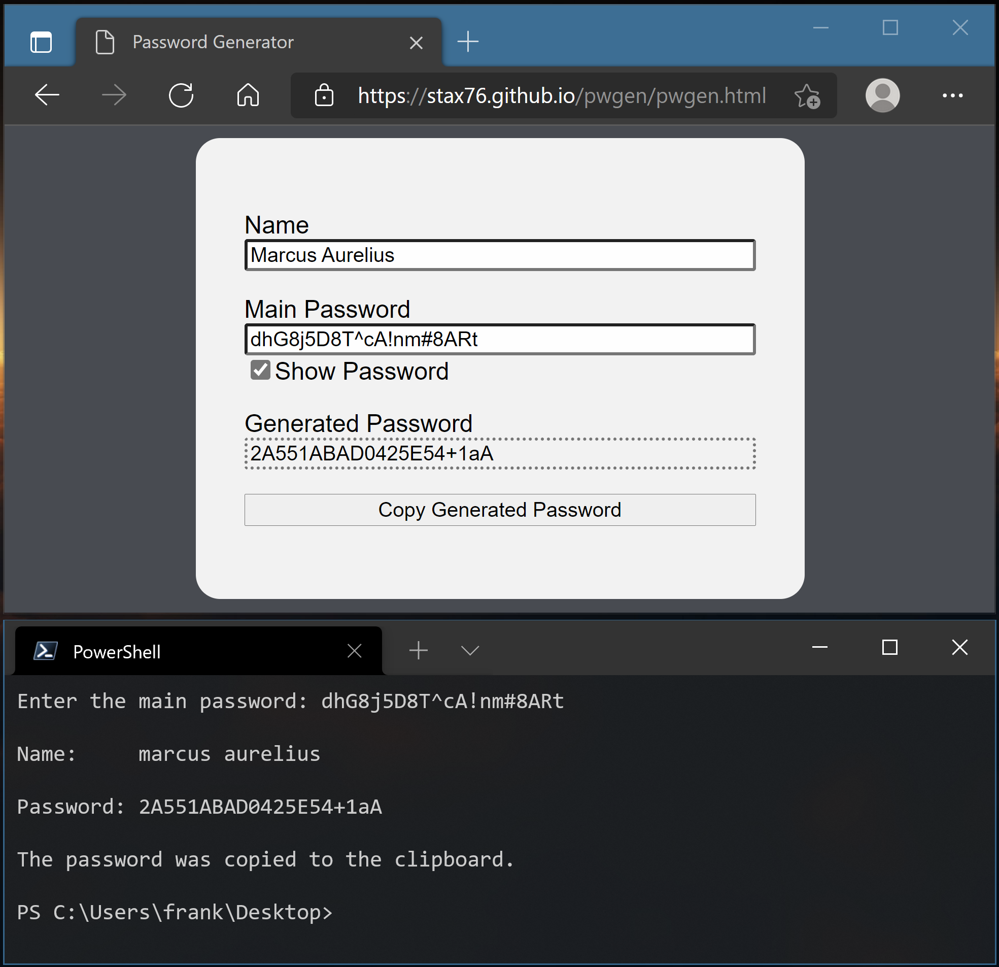

Password Generator
------------------

Generates a password based on a name and a main password.

The PowerShell version reads the name from the clipboard.

Mobile and desktop layout and screen size is supported by the HTML version which has a responsive design.

The code is very simple making it easy to review and modify.

The name can be a URL, it's automatically converted like so:

`HTTPS://WWW.AAA.COM/BBB/CCC --> aaa`

The name is always converted to lower case.

Ensure to use a [strong password](https://en.wikipedia.org/wiki/Password_strength)
to prevent [password cracking](https://en.wikipedia.org/wiki/Password_cracking).

This password generator should only be used for services with
low security requirements. For services with higher security
requirements I recommend using a professional password manager
such as [BitWarden](https://bitwarden.com).

A similar app can be found here: https://ss64.com/pass

